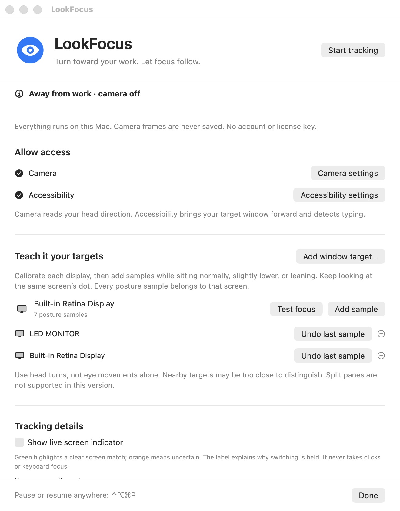
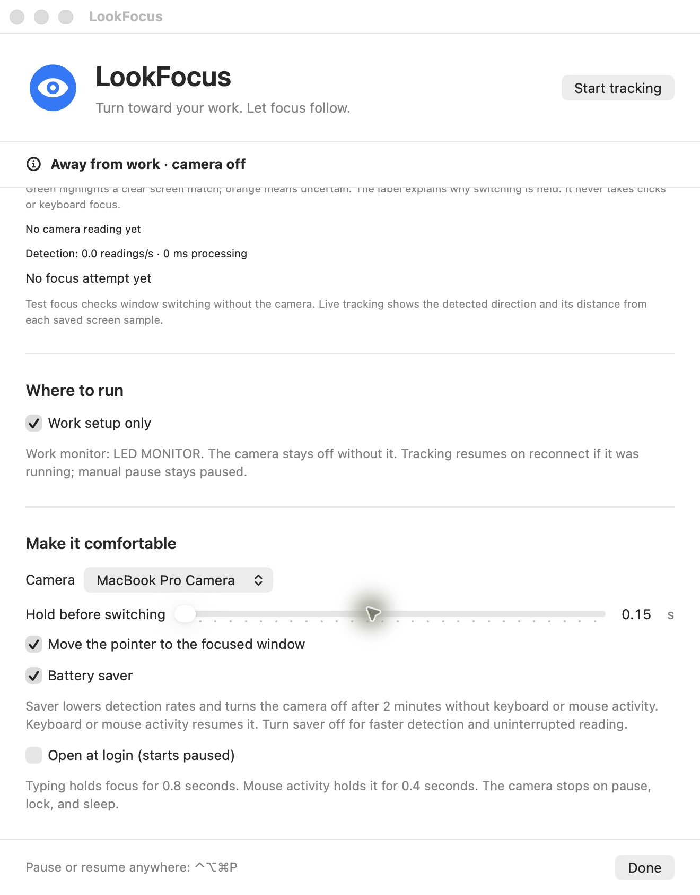

# LookFocus

An experimental macOS utility that brings focus to a calibrated screen or window when you turn your head toward it. Built in Swift with Apple Vision, AVFoundation, SwiftUI, and macOS Accessibility.

I built this to reduce the repeated “look at the other screen, move the mouse, click, then type” routine at my desk. Inspired by [GlanceSwitch](https://glanceswitch.com/), with an independent implementation. This project is not affiliated with GlanceSwitch.

**Status:** early personal project. Head-direction accuracy and reliable two-way switching are still being improved. This is not a precise eye tracker or a production-ready accessibility tool.

## Features

- Calibrated display and named-window focus, with multiple posture samples per target.
- Local foreground-face tracking and cropped detection recovery.
- Configurable switching hold, starting at 150 ms. Detection and window activation add to the total delay.
- Keyboard and mouse activity holds to reduce unwanted switches.
- Optional screen indicator: clear/uncertain matching and the current hold reason.
- Work setup only: keep the camera off when your selected external monitor is absent.
- Battery saver enabled by default: lower processing rates and camera off after two idle minutes; keyboard/mouse activity resumes it.
- Pause shortcut, Dock/Command–Tab presence, optional login launch, and camera suspension on lock/sleep.

## Screenshots

Real app captures, with the camera paused because the saved work monitor is disconnected.





The [launch poster](docs/images/lookfocus-poster.png) is an AI-generated illustration, not a screenshot of tracking behavior. Its [generation prompt](docs/images/poster-prompt.txt) is included.

## Requirements

- macOS 14 or later and a camera. The current build has been tested on Apple silicon.
- Swift 5.9 or later and Apple command-line developer tools.
- Camera and Accessibility permission, granted by the person using the app.
- Your own persistent code-signing identity for a local app build.

No third-party Swift packages, account, paid license, or cloud inference are required. No notarized binary is currently provided.

## Build

```sh
swift test
LOOKFOCUS_SIGNING_IDENTITY="Your Code Signing Identity" bash scripts/build-app.sh
```

The app is created at `dist/LookFocus.app`. Choose one installation location, copy the app there, and keep that location and signing identity consistent across updates. Launch it normally, then grant Camera and Accessibility access in System Settings. Do not run the executable from a terminal as your normal launch path.

See [local signing](docs/local-signing.md) for the personal-build signing requirements. This repository contains no signing key or certificate. The build deliberately fails if a signing identity has not been supplied; it never falls back to ad hoc signing.

## Use

1. Choose your camera and grant the two permissions.
2. Calibrate each connected display while sitting normally and looking at its dot. Add posture samples for the same screen if you sit differently.
3. Start tracking. Setup closes to allow switching.
4. Use the eye menu or Control–Option–Command–P to pause/resume. Every launch starts paused.
5. Enable the live indicator under Tracking details when investigating missed switches. Leave it off for normal use.
6. Optionally enable Work setup only while your work monitor is connected. Reconnecting resumes previously running tracking; manual pause cancels that intent.
7. Battery saver starts enabled for new users, with lower processing rates and idle camera suspension. Disable it for faster detection or uninterrupted reading sessions.

## Privacy

Camera frames stay in process memory and are not recorded or uploaded. This source contains no networking client, analytics, license check, or cloud model.

Local user defaults store calibration angles, target/window names, display identifiers, and preferences, plus a previous calibration backup. Do not publish these settings or your private window names. Face continuity follows geometry; it does not identify a person or train an identity model.

## Limitations

- Uses head direction, not eye movement alone. Nearby directions and overlapping samples may remain ambiguous.
- No split-pane focusing or learning from clicks yet.
- Visible, accessible windows are required. Minimized windows, other Spaces, duplicate/changed titles, and app activation behavior can prevent focus.
- Recalibrate if you move your camera, screens, or seat. A work-monitor identity recognizes hardware, not your physical location.
- 150 ms is a hold setting, not an end-to-end latency guarantee. Normal inference targets up to 15 readings/s; actual rates depend on hardware and state.
- Idle saver detects keyboard/mouse inactivity. Looking around cannot wake a camera that has been stopped.
- Battery-life improvement and quiet-session idle stop/resume have not been measured in a controlled live test.

## Testing and design

```sh
swift test
swift build -c release
```

The tests cover dwell in both directions, ambiguity, input holds, face continuity, calibration persistence, work-monitor gating, detection cadence, and the idle threshold. A local optional Vision test uses images supplied through `LOOKFOCUS_MONITOR_PHOTO` and `LOOKFOCUS_MAC_PHOTO`; no photographs are bundled. Without those inputs, that test is skipped.

Read [architecture](docs/architecture.md) for the processing path and [contributing](CONTRIBUTING.md) for expectations.

## License

[MIT](LICENSE). Apple frameworks and referenced third-party products remain subject to their own terms.
