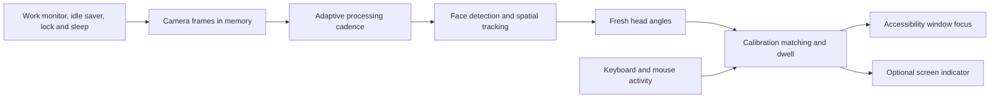

# Architecture

- **FocusCore** owns matching, dwell, calibration, persistence, face geometry guards, work-monitor rules, and cadence/idle decisions.
- **FocusVision** uses native Vision requests. A spatial lock predicts a foreground face region; fresh rectangle detection supplies yaw/pitch. Cropped recovery checks nose/eye landmarks. It never substitutes a stale angle from a tracked rectangle.
- **LookFocus** coordinates capture, input holds, screen/window lookup, native activation, settings, and the nonactivating debug overlay.

Camera work runs serially. Capture generations prevent stale callbacks from an earlier session affecting a later one. Missing/ambiguous faces hold focus. Display UUIDs let stored targets rebind after transient display identifiers change. Camera capture stops on manual pause, work-monitor absence, lock/sleep, and enabled idle suspension.

Normal inference targets 15/7.5/5 Hz during turns/settled/input holds. Saver targets 8/4/2 Hz and pauses capture after 120 seconds of keyboard/mouse inactivity. These are processing ceilings, not measured latency or battery guarantees.
